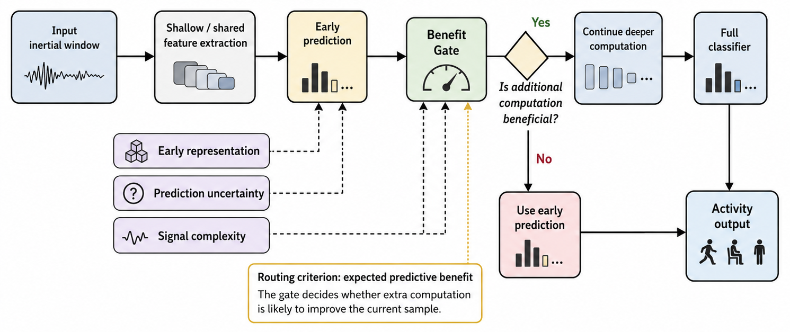

# Benefit-Gated Shared Mamba for Compute-Adaptive Wearable Human Activity Recognition at the Edge

<p align="center"></p>

This repository implements the methodology proposed in the paper "Benefit-Gated Shared Mamba for Compute-Adaptive Wearable Human Activity Recognition at the Edge".


## Paper Overview
**Abstract**: Deep learning-based wearable human activity recognition (HAR) requires efficient inference for continuous deployment on resource-constrained edge devices. Dynamic early-exit networks offer a practical way to reduce unnecessary computation, and many existing routing strategies use prediction confidence, entropy, or related uncertainty measures. Although these cues provide useful estimates of early-prediction reliability, they are not equivalent to the expected predictive gain from executing additional layers. To complement uncertainty-based routing, this paper proposes Benefit-Gated Shared Mamba, a compute-adaptive HAR framework that routes each inertial-sensor window according to the estimated marginal benefit of deeper temporal modeling. The proposed model uses a compact shared Mamba-style temporal backbone, where the early and full routes share the initial representation while the remaining blocks are executed only for samples predicted to benefit from additional computation. The benefit gate is trained with a sample-wise target derived from early and full-route prediction behavior, considering both prediction correction and cross-entropy loss reduction. These results indicate that benefit-aware routing provides an effective adaptive inference strategy for deployment-oriented wearable HAR. Experiments on five public HAR datasets show that the proposed framework preserves near full-route recognition performance while substantially reducing average FLOPs. Additional routing analysis confirms that the gate allocates computation selectively across samples and activity classes, rather than applying a uniform early-exit policy. Raspberry Pi 4B experiments further demonstrate that the reduction in average computation translates into practical edge-device latency reduction. These results suggest that benefit-aware routing is a promising adaptive inference strategy for deployment-oriented wearable HAR.

## Dataset
| Dataset  | Link |
|----------|------|
| UCI-HAR  | _https://archive.ics.uci.edu/dataset/240/human+activity+recognition+using+smartphones_ |
| PAMAP2   | _https://archive.ics.uci.edu/dataset/231/pamap2+physical+activity+monitoring_ |
| MHEALTH  | _https://archive.ics.uci.edu/dataset/319/mhealth+dataset_ |
| WISDM    | _https://www.cis.fordham.edu/wisdm/dataset.php_ |
| MotionSense    | _https://github.com/mmalekzadeh/motion-sense?tab=readme-ov-file_ |

## Requirements
```
torch==2.5.0+cu126
numpy==2.0.2
pandas==2.2.2
scikit-learn==1.6.1
matplotlib==3.10.0
seaborn==0.13.2
```
To install all required packages:
```
pip install -r requirements.txt
```

## Codebase Overview
- `model.py` - Implementation of the proposed **Benefit-Gated Shared Mamba** architecture.
The implementation uses PyTorch, Numpy, pandas, scikit-learn, matplotlib, seaborn.

## Citing this Repository

If you use this code in your research, please cite:

```
@article{Benefit-Gated Shared Mamba for Compute-Adaptive Wearable Human Activity Recognition at the Edge,
  title = {Benefit-Gated Shared Mamba for Compute-Adaptive Wearable Human Activity Recognition at the Edge},
  author={JunYoung Park and Myung-Kyu Yi}
  journal={},
  volume={},
  Issue={},
  pages={},
  year={}
  publisher={}
}
```

## Contact

For questions or issues, please contact:
- JunYoung Park : park91802@gmail.com

## License

This project is licensed under the MIT License - see the [LICENSE](LICENSE) file for details.
